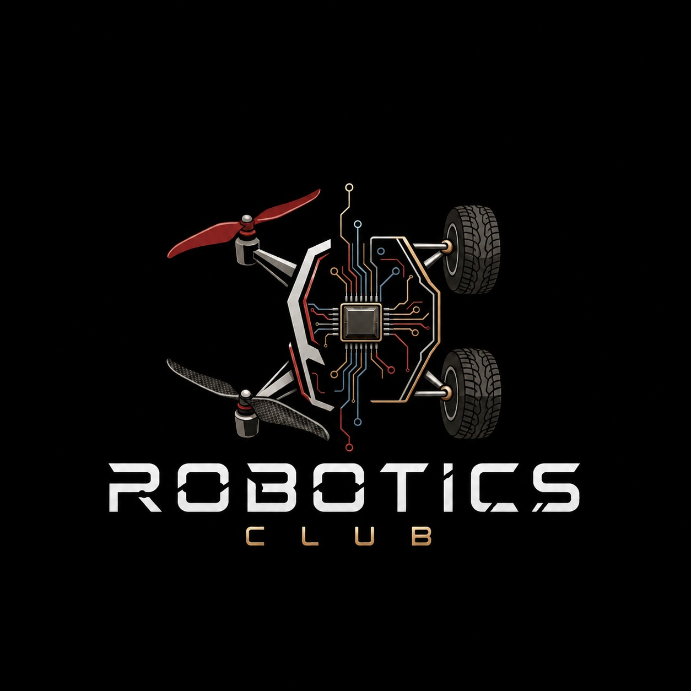

# 🤖 ROBOTICS CLUB

<p align="center">
  
</p>

<p align="center">
  <b>BUILD • CODE • CREATE • INNOVATE</b>
  <br>
  <i>Official repository for the Robotics Club</i>
</p>

---

### ⚡ What is this?

One place for **everything we build.**

🤖 Robotics Projects · 💻 Code · ⚡ Electronics · 🔧 Experiments · 📚 Workshops

```text
IDEA  →  BUILD  →  CODE  →  TEST  →  IMPROVE
```

### 📂 Repository

```text
📁 Projects
📁 Arduino
📁 ESP32
📁 Electronics
📁 Sensors
📁 Workshops
```

Every project, experiment and useful piece of code can be added here — creating a **living archive of the club's work.**

### 🚀 Build. Break. Learn. Repeat.

> **Where Ideas Become Machines.**

<p align="center">
  <b>🤖 ROBOTICS CLUB</b>
  <br>
  <sub>Think • Engineer • Innovate</sub>
</p>
